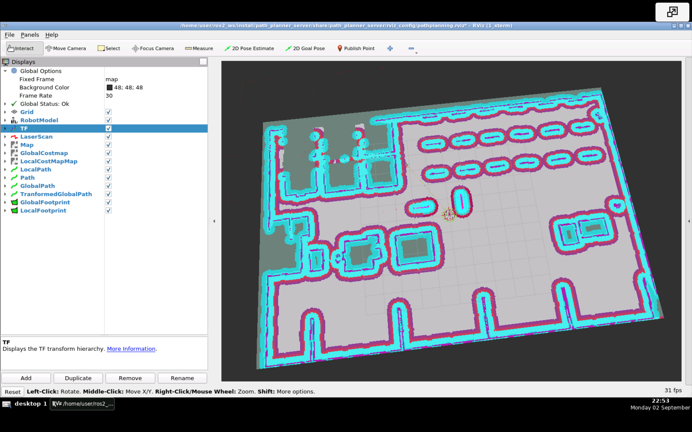

### nav2_pkgs

#### Overview

Warehouse robotics in the [AWS Small Warehouse World](https://github.com/aws-robotics/aws-robomaker-small-warehouse-world.git) and the [Neobotix MP-400](https://www.neobotix-robots.com/products/mobile-robots/mobile-robot-mp-400) industrial robot. Nav2 file by [The Construct](https://bitbucket.org/theconstructcore/nav2_pkgs.git).  

| Gazebo | Rviz2 |
| --- | --- |  
|  |  |  

#### Notes

1. Initial pose

```
ros2 topic pub --once /initialpose geometry_msgs/msg/PoseWithCovarianceStamped "{header: {stamp: {sec: 0}, frame_id: 'map'}, pose: {pose: {position: {x: 3.45, y: 2.15, z: 0.0}, orientation: {z: 1.0, w: 0.0}}}}"
```

